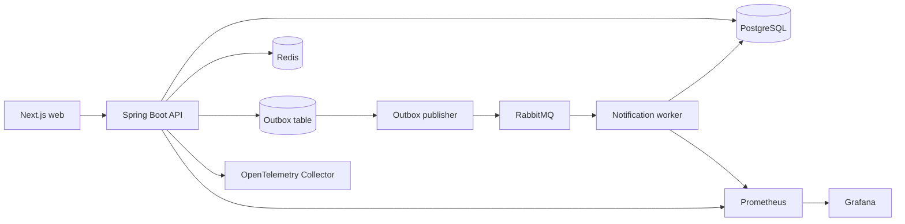

# SeatForge Ticketing Platform

SeatForge is a production-oriented, concurrency-safe ticket reservation platform. It implements the complete path from event publishing to seat holds, order creation, idempotent payment capture, QR ticket delivery, refunds, and audit trails.

The repository is intentionally a modular monolith plus a notification worker: the booking transaction stays simple and strongly consistent, while slow side effects are isolated behind a transactional outbox.

## Core guarantees

| Concern | Guarantee | Implementation |
| --- | --- | --- |
| Seat contention | At most one active hold can own a seat | PostgreSQL row lock plus a partial unique index |
| Hold lifetime | Unpaid seats return to inventory after five minutes | Database timestamps and a `SKIP LOCKED` expiry job |
| Payment retries | One idempotency key produces one capture | Unique database constraint and order-level locking |
| Order confirmation | Payment, order, hold, seat, and outbox change atomically | One PostgreSQL transaction |
| Notifications | Messages are delivered at least once without duplicate processing | Transactional outbox and consumer deduplication |
| Availability | Fast reads never override database truth | Redis cache with database fallback and invalidation |
| Abuse control | Burst traffic is bounded without sacrificing correctness | Redis rate limiting with fail-open database protection |

## Architecture



The API is split by domain boundaries inside one deployable unit. PostgreSQL remains the source of truth. Redis accelerates availability reads and rate limiting, but a Redis outage cannot create an extra booking. The notification worker is independently scalable and records every delivered event before performing its side effect.

See [Architecture](docs/architecture.md) and the [API reference](docs/api.md) for the detailed flows.

## Technology

- Java 21 and Spring Boot 3.5
- PostgreSQL 17, Flyway, and Hibernate
- Redis 8
- RabbitMQ 4
- Next.js 16, React 19, and TypeScript
- OpenTelemetry, Prometheus, and Grafana
- Testcontainers, JUnit 5, and k6
- Docker Compose and GitHub Actions

## Quick start

Requirements: Docker Desktop with Compose v2.

```bash
cp .env.example .env
docker compose up --build
```

Open the following services:

- Web application: <http://localhost:3000>
- API health: <http://localhost:8080/actuator/health>
- RabbitMQ management: <http://localhost:15672>
- Prometheus: <http://localhost:9090>
- Grafana: <http://localhost:3001>

The local seed creates a published event with 30 seats and two demo accounts:

| Role | Email | Password |
| --- | --- | --- |
| Buyer | `buyer@example.com` | `DemoBuyer123!` |
| Organizer | `organizer@example.com` | `DemoOrganizer123!` |

These credentials are for local demonstration only. Change every default secret before exposing the stack to a network.

## Demonstrate the concurrency guarantees

1. Open the web application in two private browser windows.
2. Sign in with two buyer accounts and select the same available seat.
3. Submit both hold requests at nearly the same time.
4. Observe one successful hold and one `409 SEAT_UNAVAILABLE` response.
5. Retry a payment with the same `Idempotency-Key`; both responses identify the same payment.
6. Leave a hold unpaid for five minutes; the expiry worker releases it automatically.

The automated contention test launches 100 simultaneous attempts against one seat and asserts exactly one winner:

```bash
docker compose --profile load-test run --rm k6 run /scripts/hold-contention.js
```

## Development

Backend verification:

```bash
./mvnw verify
```

Web verification:

```bash
cd web
npm ci
npm run lint
npm run build
```

The integration suite starts PostgreSQL with Testcontainers and verifies concurrent holds and payment replay behavior. Docker must be available for the integration test.

## Repository layout

```text
apps/api/                   Booking API and transactional domain logic
apps/notification-worker/   Deduplicating asynchronous consumer
web/                        Next.js demonstration interface
infra/observability/        Collector, Prometheus, and Grafana configuration
infra/aws/                  Terraform production baseline
load-tests/                 k6 contention scenario
docs/                       Architecture, API, runbook, and decisions
.github/workflows/          Build and policy automation
```

## Security and operations

JWT authentication, role-based authorization, BCrypt password hashing, validation, bounded pagination, rate limiting, non-sensitive structured logs, and immutable audit entries are enabled. Review [Security](SECURITY.md) before deployment and use the [Runbook](docs/runbook.md) during incidents.

The AWS baseline places the data stores in private subnets, runs the API and worker on ECS Fargate, terminates traffic at an Application Load Balancer, stores application secrets in Secrets Manager, and enables encrypted backups. It is a starting point that requires organization-specific DNS, certificate, alerting, and payment-provider configuration.

## Change policy

Every code or configuration change must update [CHANGELOG.md](CHANGELOG.md). CI rejects a pull request that changes project files without changing the changelog. Release entries follow Keep a Changelog and semantic versioning.

## License

This project is available under the [MIT License](LICENSE).
