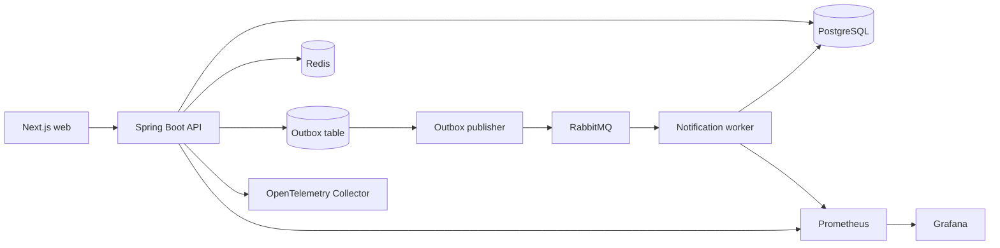

# SeatForge Ticketing Platform

SeatForge is a production-oriented, concurrency-safe ticket reservation platform. It implements the complete path from event publishing to seat holds, order creation, idempotent payment capture, QR ticket delivery, refunds, and audit trails.

The repository is intentionally a modular monolith plus a notification worker: the booking transaction stays simple and strongly consistent, while slow side effects are isolated behind a transactional outbox.

## Core guarantees

| Concern | Guarantee | Implementation |
| --- | --- | --- |
| Seat contention | At most one active hold can own a seat | PostgreSQL row lock plus a partial unique index |
| Hold lifetime | Unpaid seats return to inventory after five minutes | Database timestamps and a `SKIP LOCKED` expiry job |
| Payment retries | One idempotency key produces one capture | Unique database constraint and order-level locking |
| Order confirmation | Payment, order, hold, seat, and outbox change atomically | One PostgreSQL transaction |
| Notifications | Messages are delivered at least once without duplicate processing | Transactional outbox and consumer deduplication |
| Availability | Fast reads never override database truth | Redis cache with database fallback and invalidation |
| Abuse control | Burst traffic is bounded without sacrificing correctness | Redis rate limiting with fail-open database protection |

## Architecture



The API is split by domain boundaries inside one deployable unit. PostgreSQL remains the source of truth. Redis accelerates availability reads and rate limiting, but a Redis outage cannot create an extra booking. The notification worker is independently scalable and records every delivered event before performing its side effect.

See [Architecture](docs/architecture.md) and the [API reference](docs/api.md) for the detailed flows.

## Technology

- Java 21 and Spring Boot 3.5
- PostgreSQL 17, Flyway, and Hibernate
- Redis 8
- RabbitMQ 4
- Next.js 16, React 19, and TypeScript
- OpenTelemetry, Prometheus, and Grafana
- Testcontainers, JUnit 5, and k6
- Docker Compose and GitHub Actions

## Quick start

The only runtime requirement is a working Docker engine with Docker Compose v2. The first build downloads the required images and dependencies, so it can take several minutes.

Clone the repository:

```bash
git clone https://github.com/QihuiPan/ticketing-platform.git
cd ticketing-platform
```

On Windows, run:

```powershell
powershell -ExecutionPolicy Bypass -File .\scripts\quickstart.ps1
```

On macOS or Linux, run:

```bash
./scripts/quickstart.sh
```

The script checks Docker, creates `.env` from the safe local defaults when needed, builds the images, starts the stack in the background, and waits until the API is healthy. It does not overwrite an existing `.env` file.

Open the services after the readiness message appears:

- Web application: <http://localhost:3000>
- API health: <http://localhost:8080/actuator/health>
- RabbitMQ management: <http://localhost:15672>
- Prometheus: <http://localhost:9090>
- Grafana: <http://localhost:3001>

The local seed creates a published event with 30 seats and two demo accounts:

| Role | Email | Password |
| --- | --- | --- |
| Buyer | `buyer@example.com` | `DemoBuyer123!` |
| Organizer | `organizer@example.com` | `DemoOrganizer123!` |

These credentials are for local demonstration only. Change every default secret before exposing the stack to a network.

## Verify the installation

Run the repeatable smoke test after startup:

```bash
docker compose --profile load-test run --rm k6 run /scripts/smoke.js
```

The test verifies the full user journey: API health, sign-in, event discovery, live availability, seat hold, order creation, idempotent payment replay, QR ticket download, refund, and seat restoration. It refunds its test order so repeated runs do not consume the demo inventory.

Inspect running services or follow the application logs:

```bash
docker compose ps
docker compose logs --follow api notification-worker web
```

## Local configuration

The generated `.env` file is ignored by Git. The most commonly changed settings are:

| Variable | Default | Purpose |
| --- | --- | --- |
| `BIND_ADDRESS` | `127.0.0.1` | Keeps every published container port on the local machine |
| `POSTGRES_PASSWORD` | `change-me` | Local PostgreSQL password |
| `RABBITMQ_PASSWORD` | `change-me` | Local RabbitMQ password |
| `JWT_SECRET` | 32-character sample | Signs local access tokens |
| `SEED_DEMO` | `true` | Creates the sample event, seats, and accounts |
| `DEMO_BUYER_PASSWORD` | `DemoBuyer123!` | Password used by the API, web form, and automated checks |
| `DEMO_ORGANIZER_PASSWORD` | `DemoOrganizer123!` | Local organizer password |
| `CORS_ALLOWED_ORIGIN_PATTERNS` | `http://localhost:*` | Comma-separated browser origins allowed to call the API |
| `NEXT_PUBLIC_API_URL` | `http://localhost:8080` | API origin compiled into the web application |
| `GRAFANA_ADMIN_PASSWORD` | `admin` | Local Grafana administrator password |

Rebuild `api` and `web` after changing demo credentials, the public API URL, or CORS settings:

```bash
docker compose up --build --detach api web
```

Local defaults are intentionally convenient, not internet-safe. For any shared or hosted environment, use random secrets, set exact HTTPS CORS origins, disable demo seeding when appropriate, and follow [Security](SECURITY.md).

## Stop or reset

Stop the application while preserving local data:

```bash
docker compose down
```

To start from a completely clean database, remove the named volumes. This permanently deletes all local SeatForge data:

```bash
docker compose down --volumes --remove-orphans
```

## Troubleshooting

- **`docker compose` is unavailable:** update Docker Desktop or install the Docker Compose v2 plugin. The legacy `docker-compose` command is not supported.
- **The Docker engine is unreachable:** start Docker Desktop or the Docker daemon, then rerun the quick-start script.
- **A port is already allocated:** stop the process using ports `3000`, `3001`, `5432`, `5672`, `6379`, `8080`, `8081`, `9090`, `15672`, `4317`, or `4318`.
- **A changed database or broker password is rejected:** credentials are initialized when their volume is first created. Back up needed data, then run the documented volume-reset command.
- **The API never becomes healthy:** run `docker compose ps` and `docker compose logs --tail 200 api postgres redis rabbitmq`.
- **The web form still uses an old demo password or API URL:** rebuild the web image because `NEXT_PUBLIC_*` values are compiled at build time.

## Demonstrate the concurrency guarantees

1. Open the web application in two private browser windows.
2. Sign in with two buyer accounts and select the same available seat.
3. Submit both hold requests at nearly the same time.
4. Observe one successful hold and one `409 SEAT_UNAVAILABLE` response.
5. Retry a payment with the same `Idempotency-Key`; both responses identify the same payment.
6. Leave a hold unpaid for five minutes; the expiry worker releases it automatically.

The automated contention test launches 100 simultaneous attempts against one seat and asserts exactly one winner:

```bash
docker compose --profile load-test run --rm k6 run /scripts/hold-contention.js
```

## Development

Backend verification:

```bash
./mvnw verify
```

Web verification:

```bash
cd web
npm ci
npm run lint
npm run build
```

The integration suite starts PostgreSQL with Testcontainers and verifies concurrent holds and payment replay behavior. Docker must be available for the integration test.

## Repository layout

```text
apps/api/                   Booking API and transactional domain logic
apps/notification-worker/   Deduplicating asynchronous consumer
web/                        Next.js demonstration interface
infra/observability/        Collector, Prometheus, and Grafana configuration
infra/aws/                  Terraform production baseline
infra/aws-demo/             Cost-controlled single-node AWS portfolio demo
load-tests/                 k6 contention scenario
docs/                       Architecture, API, runbook, and decisions
.github/workflows/          Build and policy automation
```

## Security and operations

JWT authentication, role-based authorization, BCrypt password hashing, validation, bounded pagination, rate limiting, non-sensitive structured logs, and immutable audit entries are enabled. Review [Security](SECURITY.md) before deployment and use the [Runbook](docs/runbook.md) during incidents.

The [AWS production baseline](infra/aws/README.md) places the data stores in private subnets, runs the API and worker on ECS Fargate, terminates traffic at an Application Load Balancer, stores application secrets in Secrets Manager, and enables encrypted backups. It is a starting point that requires organization-specific DNS, certificate, alerting, and payment-provider configuration.

For a public portfolio demonstration, the separate [AWS single-node demo](infra/aws-demo/README.md) runs the application and its data services on one EC2 instance, uses Systems Manager instead of SSH, and adds AWS Budget notifications. It is designed to control cost and is not a high-availability production substitute.

## Change policy

Every code or configuration change must update [CHANGELOG.md](CHANGELOG.md). CI rejects a pull request that changes project files without changing the changelog. Release entries follow Keep a Changelog and semantic versioning.

## License

This project is available under the [MIT License](LICENSE).
