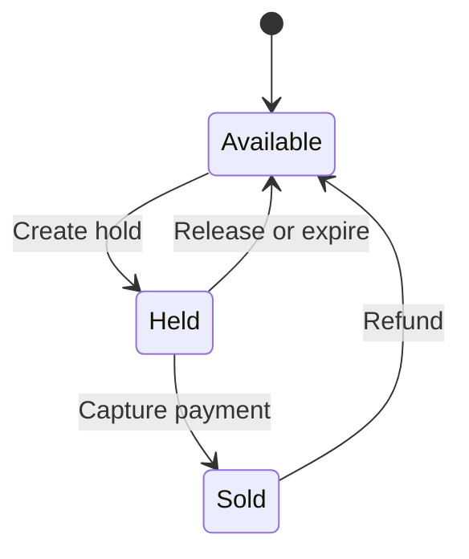

# Architecture

## System boundaries

The booking API is a modular monolith. Authentication, catalog, inventory, holds, orders, payments, ticketing, refunds, auditing, caching, and outbox publishing share one transaction boundary and one PostgreSQL schema. The notification worker is separate because notification latency and retry behavior must not extend the payment transaction.

PostgreSQL is authoritative for every invariant. Redis is an optimization. RabbitMQ transports already-committed integration events. If Redis or RabbitMQ is unavailable, the database still prevents double booking and completed payments remain recoverable from the outbox.

## Reservation state machine

A hold is valid only while its status is `ACTIVE` and `expires_at` is later than the database transaction time. Availability responses derive the displayed state from both the seat and its active hold.

## Contended hold transaction

1. Start a PostgreSQL transaction.
2. Load the seat with `SELECT ... FOR UPDATE`.
3. Reject a sold seat.
4. Lock and inspect an existing active hold.
5. Expire a stale hold and flush that change when necessary.
6. Insert the new five-minute hold.
7. Commit and invalidate the session availability cache.

The row lock serializes contenders. The partial unique index on `seat_holds(seat_id) WHERE status = 'ACTIVE'` is an independent defense against application mistakes. A conflict returns HTTP 409 and never waits indefinitely at the application layer.

## Expiry processing

The scheduled expiry job claims small batches with `FOR UPDATE SKIP LOCKED`. Multiple API instances can run the job without selecting the same hold or blocking one another. Each claimed hold changes to `EXPIRED`, and the related availability cache is invalidated after the transaction.

## Payment idempotency

Clients send an `Idempotency-Key` header. The service first checks the unique key, locks the order, checks the key again, validates ownership and hold validity, and then performs these writes in one transaction:

- Insert one captured payment.
- Confirm the order.
- Confirm the hold.
- Mark the seat sold.
- Assign a ticket code.
- Append an `ORDER_CONFIRMED` outbox event.
- Append an audit entry.

Concurrent retries therefore return the same payment instead of producing a second capture.

## Transactional outbox

The payment transaction never publishes directly to RabbitMQ. It writes an event to `outbox_events`. A scheduled publisher claims unpublished rows with `SKIP LOCKED`, publishes a persistent message, and records `published_at`. A process failure between publish and marking may cause redelivery, so the notification worker inserts the event identifier into `notification_deliveries` before processing. The primary key makes duplicate handling a no-op.

RabbitMQ retry and dead-letter queues isolate poison messages. Operators can inspect the dead-letter queue, correct the cause, and replay a message without changing booking state.

## Cache and rate limiting

Availability responses are cached briefly by session. Holds, expiry, payment, and refunds invalidate the corresponding cache key. Cache lookup failures fall back to PostgreSQL. Redis also stores per-user request counters for high-risk write endpoints; if Redis fails, requests proceed to the database because row locks and constraints remain the final correctness boundary.

## Observability

The services emit structured JSON logs with trace and span identifiers, Micrometer metrics, Prometheus endpoints, and OTLP traces. Important custom metrics include booking attempts, booking conflicts, expired holds, outbox backlog, and publish failures.

Recommended service objectives:

| Signal | Target |
| --- | --- |
| Availability read p95 | Less than 200 ms |
| Hold creation p95 | Less than 400 ms |
| Payment capture p95 | Less than 800 ms, excluding external provider latency |
| Successful request rate | At least 99.9% |
| Unpublished outbox age | Less than 60 seconds |
| Double-booking count | Exactly zero |

## Scaling model

API instances are stateless and scale horizontally. PostgreSQL connection pools must be sized against the database limit rather than multiplied without bounds. Notification workers scale by RabbitMQ consumer concurrency. Hot-event traffic can be isolated by session partitions at the application edge while the database constraints continue to enforce the global invariant.
