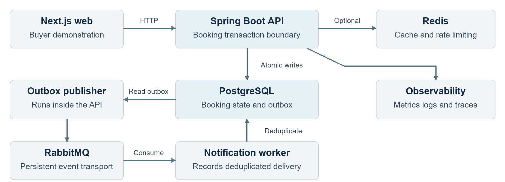

# SeatForge Ticketing Platform Portfolio

**Qihui Pan | Software Engineering Portfolio | September 2026**

SeatForge is a full-stack ticket reservation project focused on preserving inventory and order consistency when buyers compete for the same seat or repeat checkout requests. It combines a Next.js buyer interface, a Spring Boot booking API, and a separate notification worker in a reproducible Docker environment.

[Download the PDF portfolio](portfolio/SeatForge_Portfolio.pdf) · [Download the editable Word portfolio](portfolio/SeatForge_Portfolio.docx) · [Source code](https://github.com/QihuiPan/ticketing-platform) · [Verified CI run](https://github.com/QihuiPan/ticketing-platform/actions/runs/34107826199)

## Product scope

- Buyer interface for event discovery, seat availability, five-minute holds, order creation, simulated payment capture, and QR ticket download.
- APIs for buyer registration, authentication, order history, and refunds, plus organizer event publishing and session creation.
- JWT authentication, role and ownership checks, request validation, and audit records.
- Transactional outbox publishing, persistent RabbitMQ messages, consumer deduplication, retries, and a dead-letter queue.
- Local startup helpers, observability configuration, deployment documentation, and automated verification.

## Architecture



The API is a modular monolith so payment, order, hold, seat, ticket, audit, and outbox writes share one database transaction. The notification worker runs separately to keep message handling out of the checkout transaction.

### Seat ownership

PostgreSQL row locks serialize competing requests. A partial unique index permits only one active hold per seat. Five-minute holds expire through a batched `SKIP LOCKED` job. Redis accelerates availability reads and rate limiting; PostgreSQL remains authoritative when Redis is unavailable.

### Payment retries

An idempotency key is serialized before the order is locked. Repeated requests return the existing payment identifier. The order, hold, sold seat, payment record, ticket code, audit entry, and outbox event change atomically. Refunds reopen inventory and support repeat requests.

### Event delivery

Committed outbox events are published to RabbitMQ with publisher confirmation. Redelivery is possible, so the consumer stores a unique event identifier before recording delivery. The current worker records delivery deterministically and does not call an external email provider.

### Observability

Prometheus metrics and Grafana configuration support local inspection. An optional OpenTelemetry overlay exports traces and correlated logs and connects metric exemplars to active trace identifiers. Bounded metric labels avoid user identifiers and raw request paths. The external observability platform is optional for local startup.

### Design tradeoff

Keeping the write path together simplifies consistency and deployment. A popular seat is still a serialized database resource. Scaling API instances requires database capacity planning and realistic load measurement.

## Verified results

The [September 7, 2026 CI run](https://github.com/QihuiPan/ticketing-platform/actions/runs/34107826199) passed for application revision `d9577d3c966a981eb55b0f6c36c3ab36d467f46b`.

| Check | Observed result | Evidence |
| --- | --- | --- |
| Seat contention | 100 simultaneous attempts; exactly one successful hold | PostgreSQL integration test |
| Concurrent payment retries | 25 retries; one payment identifier and one outbox event | PostgreSQL integration test |
| Backend suite | 10 tests passed; zero failures, errors, or skipped tests | Maven CI log |
| Complete booking flow | 19 of 19 checks passed; zero failed HTTP requests out of 13 | k6 fresh-install CI log |
| Build and configuration | Web verification, three container builds, and Terraform validation passed | GitHub Actions |

The integration suite also verifies payment replay, hold expiry, and idempotent refunds. These results demonstrate correctness in the test scenarios. They do not establish production throughput, latency, availability, or business impact.

Source evidence: [ConcurrencyIntegrationTest.java](https://github.com/QihuiPan/ticketing-platform/blob/d9577d3c966a981eb55b0f6c36c3ab36d467f46b/apps/api/src/test/java/com/portfolio/ticketing/ConcurrencyIntegrationTest.java), [smoke.js](https://github.com/QihuiPan/ticketing-platform/blob/d9577d3c966a981eb55b0f6c36c3ab36d467f46b/load-tests/smoke.js), and [CI workflow](https://github.com/QihuiPan/ticketing-platform/blob/d9577d3c966a981eb55b0f6c36c3ab36d467f46b/.github/workflows/ci.yml).

## Technology

| Layer | Implementation |
| --- | --- |
| Application | Java 21, Spring Boot 3.5, Next.js 16, React 19, TypeScript |
| Data and messaging | PostgreSQL 17, Flyway, Redis 8, RabbitMQ 4 |
| Verification and delivery | JUnit, Testcontainers, k6, Docker Compose, GitHub Actions, Terraform |
| Observability | OpenTelemetry, Prometheus, Grafana |

## Try the project

Install Docker with Compose v2 and clone the repository:

```bash
git clone https://github.com/QihuiPan/ticketing-platform.git
cd ticketing-platform
```

On Windows:

```powershell
powershell -ExecutionPolicy Bypass -File .\scripts\quickstart.ps1
```

On macOS or Linux:

```bash
./scripts/quickstart.sh
```

Open <http://localhost:3000>. The [README](../README.md#quick-start) provides demo accounts, configuration, verification, and troubleshooting instructions. The complete smoke test covers login, catalog discovery, seat holds, orders, payment replay, QR download, refunds, and inventory restoration.

## Current delivery scope

SeatForge is a runnable demonstration with simulated payment capture and recorded notification delivery. AWS Terraform provides a single-node demo and a production infrastructure baseline. Public application hosting and a live deployment URL are not part of this portfolio handoff. Real payment and email providers, environment-specific HTTPS and secrets, and production load validation remain deployment work.

## Short project introduction

SeatForge is a full-stack ticket reservation project built with Spring Boot, PostgreSQL, Redis, RabbitMQ, and Next.js. It uses database locking to control seat contention, idempotency keys to make checkout retries safe, and a transactional outbox to separate booking from notification processing. Public CI verifies 100 simultaneous attempts for one seat, concurrent payment retries, and the full booking and refund flow. Docker startup helpers and deployment documentation make the demonstration reproducible.

Prepared September 11, 2026. Application evidence is pinned to `d9577d3`; later documentation commits do not change that tested application revision.
